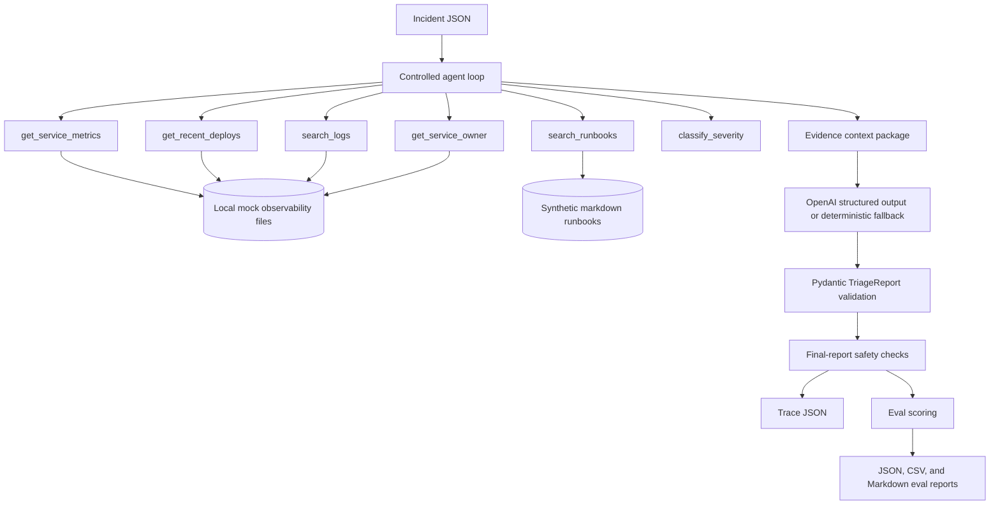

# Architecture

This project is intentionally local and bounded. It models an incident triage workflow without connecting to real infrastructure, ticketing systems, paging systems, or observability vendors.

## System Diagram

## Runtime Flow

1. Load and validate an `IncidentInput`.
2. Execute the fixed read-only tool sequence. The model does not choose arbitrary tools; this is a deliberate safety and evaluation boundary.
3. Build a context package from metrics, deploys, logs, runbooks, owner data, and deterministic severity classification.
4. Ask the configured OpenAI model for a structured `TriageReport`, or use deterministic fallback mode for local/CI reproducibility.
5. Validate the report with Pydantic.
6. Run final-output safety checks for destructive operational language.
7. Persist an `AgentTrace` with tool calls, arguments, summaries, prompt hash, safety status, latency, and estimated cost.
8. During evals, score each trace against expected severity, tools, likely causes, evidence, recommendations, and forbidden actions.

## Module Responsibilities

| Module | Responsibility |
| --- | --- |
| `agent.py` | Orchestrates the controlled triage loop and trace creation. |
| `tools.py` | Implements read-only local tools over mock files. |
| `tool_registry.py` | Exposes allowed tools and blocks mutating tool names. |
| `llm_client.py` | Calls OpenAI structured output or deterministic fallback generation. |
| `schemas.py` | Defines strict Pydantic contracts for incidents, reports, traces, and evals. |
| `safety.py` | Detects destructive final-report language. |
| `trace.py` | Saves trace JSON artifacts. |
| `evaluators.py` | Scores traces and aggregates eval metrics. |
| `eval_sets.py` | Loads and validates eval JSONL definitions. |
| `cli.py` | Powers scripts and installed console commands. |

## Boundaries

The agent can:

- read local mock metrics, logs, deploys, owner data, and runbooks
- classify severity with deterministic helper logic
- generate a structured triage report
- recommend human next actions
- save traces and eval reports

The agent cannot:

- rollback deployments
- restart pods or services
- scale infrastructure
- delete or modify resources
- change IAM or configuration
- disable alerts
- create tickets or page real people
- connect to real AWS, Kubernetes, PagerDuty, Slack, Datadog, or databases

## Data Contracts

The main externally visible contracts are:

- `IncidentInput`: input incident JSON.
- `TriageReport`: final structured report.
- `ToolCall`: trace record for each read-only tool invocation.
- `AgentTrace`: full run artifact, including schema version, model, prompt version, and prompt SHA-256 fingerprint.
- `EvalCase`: expected behavior for one eval scenario.
- `EvalResult`: scored result with diagnostics.

All schemas forbid unknown fields so accidental shape drift is caught early.

## Eval Boundary

The eval runner is deterministic enough to use as a regression gate. CI runs the fallback path with no OpenAI key, while local runs can use the real model path. Both paths produce the same trace and scoring shapes, so prompt changes and fallback behavior can be compared with the same tooling.

The deterministic fallback is a reproducibility mechanism, not evidence of model quality. The committed OpenAI snapshot documents one model-backed run; the fallback gate proves that the local harness, schemas, safety checks, and reporting stay intact without network access.